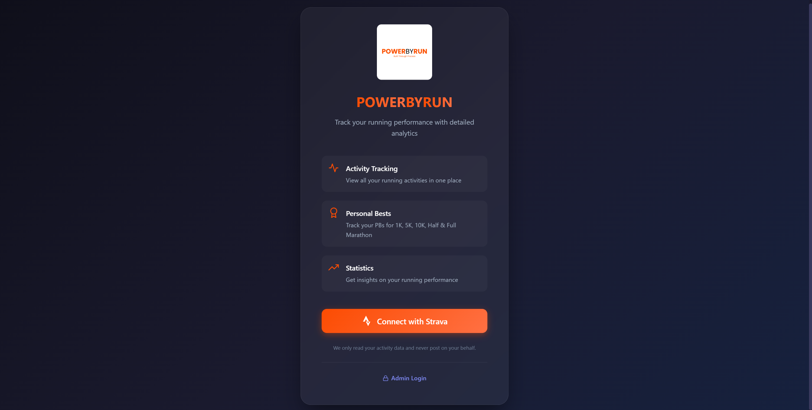
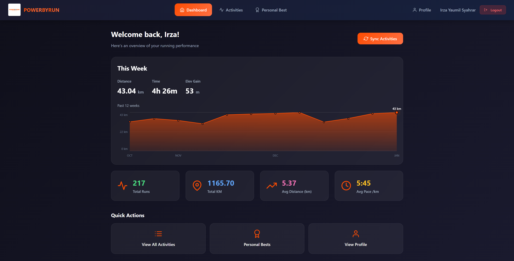
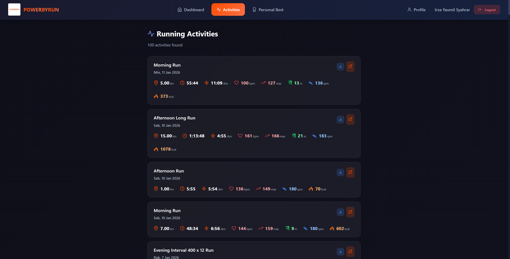
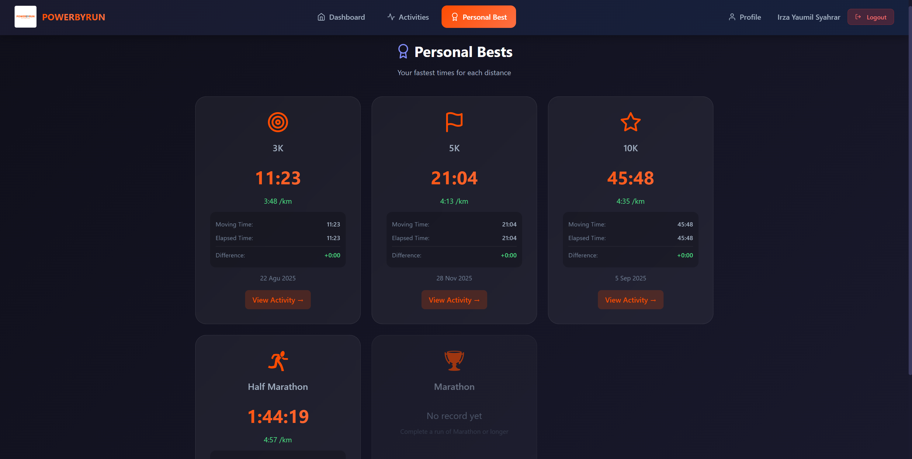
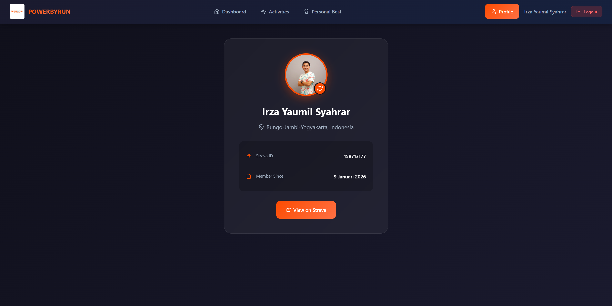
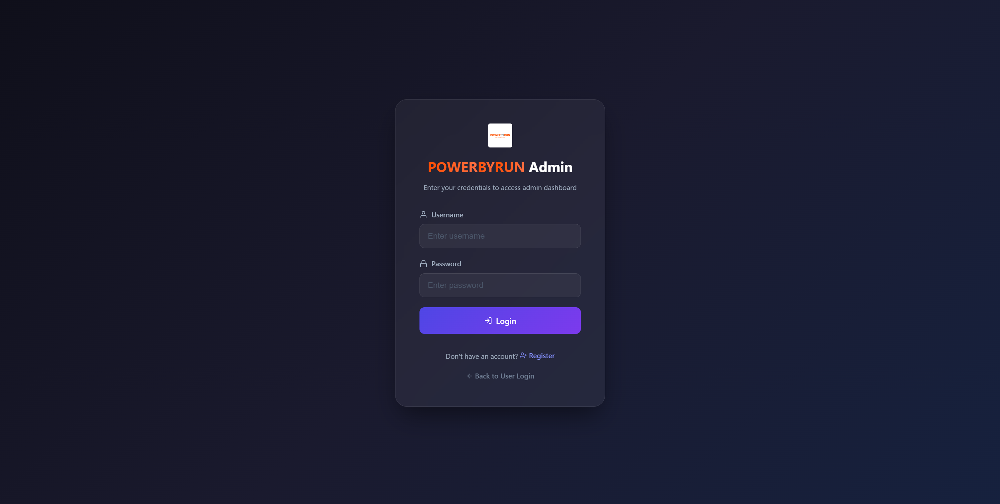
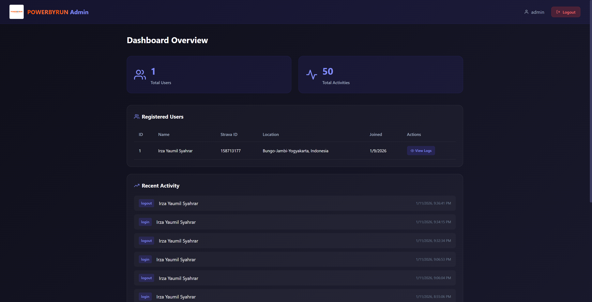
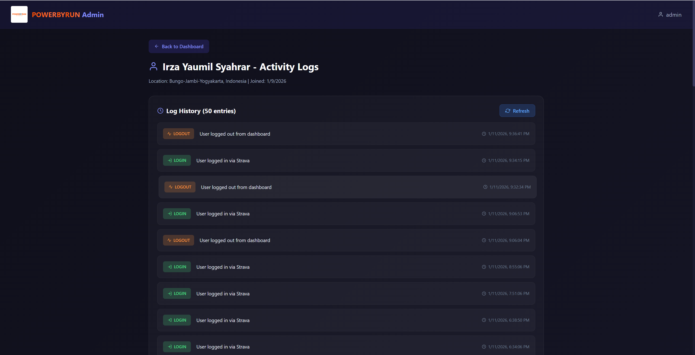

# 🏃 POWERBYRUN - Dashboard Performa

A full-stack web application that integrates with the **Strava API** to display and analyze running activities. Built with React (Vite) for the frontend and Express.js with MySQL for the backend.


---

## 📸 Screenshots

### User Pages

| Page | Screenshot |
|------|------------|
| **Login** - Strava OAuth Login |  |
| **Dashboard** - Activity Statistics & Weekly Chart |  |
| **Activities** - Running Activities List |  |
| **Personal Best** - Personal Records |  |
| **Profile** - Strava Profile Info |  |

### Admin Pages

| Page | Screenshot |
|------|------------|
| **Admin Login** - Username/Password Login |  |
| **Admin Dashboard** - Platform Statistics |  |
| **Activity Logs** - User Activity Monitoring |  |

---

## ✨ Features

### 👤 User Features
| Feature | Description |
|---------|-------------|
| 🔐 **Strava OAuth Login** | Authenticate with your Strava account using OAuth 2.0 |
| 📊 **Dashboard** | View total runs, distance, time, and weekly activity chart |
| 🏃 **Activities** | Browse all running activities with splits (per km) |
| 🏆 **Personal Best** | Track your personal records (pace, distance, heartrate) |
| 👤 **Profile** | View and sync your Strava profile information |
| 🔄 **Sync from Strava** | Sync activities directly from Strava API |

### 🛡️ Admin Features
| Feature | Description |
|---------|-------------|
| 🔑 **Admin Authentication** | Separate login system with JWT tokens |
| 📈 **Admin Dashboard** | View platform statistics (users, activities, distance) |
| 📋 **User Logs** | Monitor user activity logs (login, page views, actions) |

---

## 🛠 Tech Stack

| Layer | Technology | Version |
|-------|------------|---------|
| **Frontend** | React.js | 19.2.0 |
| | Vite | 7.2.4 |
| | React Router DOM | 7.12.0 |
| | Axios | 1.13.2 |
| | React Icons | 5.5.0 |
| **Backend** | Express.js | 4.18.0 |
| | Sequelize ORM | 6.35.0 |
| | MySQL2 | 3.6.0 |
| | JSON Web Token | 9.0.3 |
| | Bcryptjs | 3.0.3 |
| **External API** | Strava API | OAuth 2.0 |

---

## 📡 API Endpoints

### Data Source
All running activity data is fetched from **[Strava API](https://developers.strava.com/)** using OAuth 2.0 authentication.

### Authentication APIs

| Method | Endpoint | Description |
|--------|----------|-------------|
| GET | `/auth/strava` | Redirect to Strava OAuth |
| GET | `/auth/callback` | Handle OAuth callback |
| GET | `/auth/user/:userId` | Get current user info |
| POST | `/auth/sync-profile/:userId` | Sync profile from Strava |
| POST | `/auth/logout/:userId` | Logout user |

### Activity APIs

| Method | Endpoint | Description |
|--------|----------|-------------|
| GET | `/api/activities/:userId` | Get all activities |
| GET | `/api/activities/:userId/stats` | Get activity statistics |
| GET | `/api/activities/:userId/weekly` | Get weekly stats (12 weeks) |
| GET | `/api/activities/splits/:activityId` | Get activity splits |
| POST | `/api/activities/sync/:userId` | Sync activities from Strava |

### User APIs

| Method | Endpoint | Description |
|--------|----------|-------------|
| GET | `/api/user/:userId` | Get user profile |
| GET | `/api/personal-best/:userId` | Get personal best records |

### Admin APIs (JWT Required)

| Method | Endpoint | Description |
|--------|----------|-------------|
| POST | `/admin/register` | Register new admin |
| POST | `/admin/login` | Admin login |
| GET | `/admin/users` | Get all users |
| GET | `/admin/logs` | Get all user logs |
| GET | `/admin/logs/:userId` | Get logs by user |
| GET | `/admin/dashboard` | Get dashboard stats |

---

## 🚀 Installation

### Prerequisites
- Node.js (v18+)
- MySQL (v8.0+)
- Strava Developer Account

### Setup

```bash
# Clone repository
git clone <repository-url>
cd StravaProject

# Install server dependencies
cd server
npm install

# Install client dependencies
cd ../client
npm install
```

### Configuration

Create `.env` file in `server/` directory:

```env
PORT=5000
FRONTEND_URL=http://localhost:5173

DB_HOST=localhost
DB_USER=root
DB_PASSWORD=your_password
DB_NAME=strava_dashboard

JWT_SECRET=your_jwt_secret

STRAVA_CLIENT_ID=your_strava_client_id
STRAVA_CLIENT_SECRET=your_strava_client_secret
STRAVA_REDIRECT_URI=http://localhost:5000/auth/callback
```

### Run Application

```bash
# Terminal 1 - Start Server
cd server
npm run dev

# Terminal 2 - Start Client
cd client
npm run dev
```

- **Frontend**: http://localhost:5173
- **Backend**: http://localhost:5000

---

## 📄 License

This project is created for educational purposes - **Pengembangan Web Service, Semester 5**.
